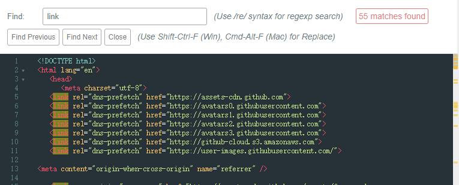
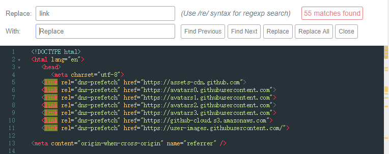

# cm-findreplace
CodeMirror Find-Replace for Tool Panel

CodeMirror 工具 查找替换

提供更加可视化的查找替换工具。

> 所需依赖：CodeMirror文件夹下的
>
> `codemirror/addon/display/panel.js`
>
> `codemirror/addon/search/searchcursor.js`

1.初始化 CodeMirror 之后
```javascript
var myTextarea = document.getElementById('mytextarea')
var editor = CodeMirror.fromTextArea(myTextarea, {
  lineNumbers: true
});
```

2.举个栗子

如果没有配置快捷键方案 ( 详见：https://codemirror.net/doc/manual.html#keymaps )

CodeMirror默认使用 `Ctrl-F (Win), Cmd-F (Mac)` 作为查找按键，使用 `Shift-Ctrl-F (Win), Cmd-Alt-F (Mac)` 作为替换呼出按键。

3.界面样式 可在 `src/cmfindreplace.css` 中修改


CodeMirror Find


CodeMirror Find-Replace
